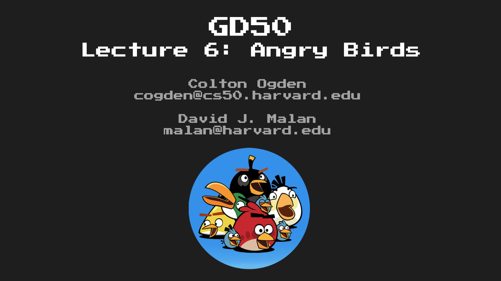
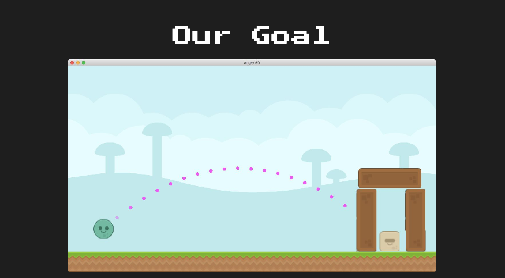

# GD50-angry-birds
*Angry Birds*


Lecture Slides: [Lecture 6](https://github.com/jazorhe/GD50-angry-birds/blob/main/lecture6.pdf)




### Overview
-   [Our Goal](#our-goal)
-   [Lecture Notes](#lecture-notes)
-   [Assignment](#assignment)
-   [Submission](#submission)
-   [Useful Links](#useful-links)


<br>

## Our Goal




## Lecture Notes
**Topics**:
-   [Box2d](#box2d)
-   [Mouse Input](#mouse-input)


**Related Links**:
-   <https://love2d.org/wiki/love.physics>
-   <https://love2d.org/wiki/Tutorial:Physics>
-   <http://www.iforce2d.net/b2dtut/introduction>


### Box2d
#### The World:
-   Performs all physics calculations on all "Bodies" it holds a reference to.
-   Possesses a gravity value that affects every Body in the scene in addition to each Body's own characterstics.
-   `love.physics.newWorld(gravX, gravY, [sleep])`: Creates a new World object to simulate physics, as provided by BoxeD, with gravX and gravY for global gravity and an optional sleep parameter to allow non-moving Bodies in our world to sleep (to not have their physics calculated when they're completely still, for performance gains)


#### Bodies:
-   Abstract containers that manage position and velocity
-   Can be manipulated via forces (or just raw positional assignment) to bring about physical behaviour when updated by the `world`
-   `love.physics.newBody(world, x, y, type)`: Creates a new Body in our `world` at x and y, with type being what kind of physical body it it ('static', 'dynamic' or 'kinematic', which we will explore)


#### Fixtures:
-   The individual components of Bodies that possess physical characteristics to influence Bodies' movements.
-   Attach shapes to Bodies, influencing collision.
-   Have densities, frictional characteristics, restitution (bounciness), and more
-   `love.physics.newCircleShape(radius)`
-   `love.physics.newRectangleShape(width, height)`
-   `love.physics.newEdgeShape(x, y, width, height)`
-   `love.physics.newChainShape(loop, x1, y1, x2...)`
-   `love.physics.newPolygonShape(x1, y1, x2, y2...)`
-   `love.physics.newFixture(body, shape)`: Creates a new Fixture for a given body, attaching the shape to it relative to the center, influencing it for the `world`'s collision detection.


#### Implementation:
-   Definition:

    ```lua
    -- new Box2D "world" which will run all of our physics calculations
    world = love.physics.newWorld(0, 300)

    -- body that stores velocity and position and all fixtures
    boxBody = love.physics.newBody(world, VIRTUAL_WIDTH / 2, VIRTUAL_HEIGHT / 2, 'static')

    -- shape that we will attach using a fixture to our body for collision detection
    boxShape = love.physics.newRectangleShape(10, 10)

    -- fixture that attaches a shape to our body
    boxFixture = love.physics.newFixture(boxBody, boxShape)
    ```

-   Rendering:

    ```lua
    -- draw a polygon shape by getting the world points for our body, using the box shape's
    -- definition as a reference
    love.graphics.polygon('fill', boxBody:getWorldPoints(boxShape:getPoints()))
    ```


### Mouse Input
-   `love.mousepressed(x, y, key)`: Callback that executes whenever the user clicks a mouse button; has access to the X and Y of th emouse press, as well as the particular "key" (or mouse button).
-   `love.mousereleased(x, y, key)`: The opposite of `love.mousepressed`, which is fired whenever we release a mouse key in our scene; also takes in the coordinates of the release and the key that was released.
-   Similar Implementation with the keyboard with a `wasPresed` table to store all pressed and released keys (however, my implementation with the match 3 game is also valid)

### Other Notes
#### Collision Callback
-   <https://love2d.org/wiki/Tutorial:PhysicsCollisionCallbacks>
-   Destroying Bodies
-   Multiple fixtures in a body
-   Remove from a table in reverse index order
-   Keep Data Driven Design in mind
-   Potential Expanded Features:
    -   More shapes (arbitrary thanks to polygons)
    -   Compound obstacles (see pulley, motor, and weld joints, plus more)
    -   Levels defined as tables
    -   Birds (aliens) with different shooting mechanics, like explosions
    -   Different obstacle materials with varying densities


<br>

## Assignment
### Objectives
-   [x] [**Code Reading**](#code-reading)Read and understand all of the Legend of Zelda source code from Lecture 5.
    -   [x] [`main.lua`](#mainlua)
    -   [x] [`Dependencies.lua`, `constants.lua` and `Util.lua`](#dependencieslua-constantslua-and-utillua)
    -   [x] [`Background.lua`](#backgroundlua)
    -   [x] [`Alien.lua`, `AlienLaunchMarker.lua` and `Obstacle.lua`](#alienlua-alienlaunchmarkerlua-and-obstaclelua)
    -   [x] [`Level.lua`](#levellua)
    -   [x] [`StateMachine and States`](#statemachine-and-states)


-   [ ] [**Triple Aliens**](#task): Implement it such that when the player presses the space bar after they’ve launched an `Alien` (and it hasn’t hit anything yet), split the `Alien` into three Aliens that all behave just like the base `Alien`.


<br>

### Code Reading
#### `main.lua`
`main.lua` has been kept fairly simple and only limited to the highest level of function controls. I would also probably put all the mouse contro land keyboard control into a secont `Control.lua` to keep main.lua even simplier. Note that in order for love2d to work better with rgba and also better with the way that I am more familiar with, I have decided to write a simple `rgba()` function to take care of this:

```lua
function rgba(r, g, b, a)
    if not a then
        a = 1
    end

    return r/255, g/255, b/255, a
end
```


#### `Dependencies.lua`, `constants.lua` and `Util.lua`
Note that obstacles in this case have not been placed in a clear layout that allow us to easily acces each frame logically. What we have done for this case is to manually created quads for the few obstacles that we need. This is not an efficient way to do things if it is large scale. Everything else is pretty similar to what we have done and very straight forward.

Also note that we should always keep **Data Driven Design** in mind!!! We can have something like below for a game like this:

```lua
levels = {
    [1] = {
        ['obstacles'] = {
            x = --,
            y = --,
            ...
        },
        ['aliens'] = {
            x = --,
            y = --,
            ...
        },
        ...
    }
}
```

Thus we can have each level set out and just iterate through the tables on state change. We can effectively shift some of the work to the art team and level design team compared to have to hard code all components on screen for each level. This will also make level design hugely flexible and workable.


#### `Background.lua`
A simple camera shift class. We can tweak it for larger levels if needed.


#### `Alien.lua`, `AlienLaunchMarker.lua` and `Obstacle.lua`
Note that `userData` in here can be used for a lot more. You can pass in a whole params table for later use when a collision occurs or resolves. These information can help you with finding out the bodies/fixtures that are undergoing the collision and also other properties of them.

The `Alien` and the `Obstacle` class has been kept minimal here for demo purposes only. But there is huge potential behind all this. Read into documentation of `love.physics` and `Box2D` for advanced usages.

`AlienLaunchMarker.lua` takes care of the launching trajectory and plots its shape so that the player can visualise the outcome of the shot. It:
-   Deals with mouse press states with a variable `self.aiming`
-   Initialize player `Alien`
-   Calculate Impulse force from mouse movements while aiming, apply the force while aiming finished and not launched with `self.launched`

```lua
-- apply the difference between current X,Y and base X,Y as launch vector impulse
self.alien.body:setLinearVelocity((self.baseX - self.shiftedX) * 10, (self.baseY - self.shiftedY) * 10)
```

-   Capping mouse movements x, y

```lua
elseif self.aiming then
    self.rotation = self.baseY - self.shiftedY * 0.9
    self.shiftedX = math.min(self.baseX + 30, math.max(x, self.baseX - 30))
    self.shiftedY = math.min(self.baseY + 30, math.max(y, self.baseY - 30))
```

-   Aiming trajectory rendering

```lua
if self.aiming then

    -- render arrow if we're aiming, with transparency based on slingshot distance
    local impulseX = (self.baseX - self.shiftedX) * 10
    local impulseY = (self.baseY - self.shiftedY) * 10

    -- draw 6 circles simulating trajectory of estimated impulse
    local trajX, trajY = self.shiftedX, self.shiftedY
    local gravX, gravY = self.world:getGravity()

    -- http://www.iforce2d.net/b2dtut/projected-trajectory
    for i = 1, 90 do

        -- magenta color that starts off slightly transparent
        love.graphics.setColor(rgba(255, 80, 255, (255 / 12) * i))

        -- trajectory X and Y for this iteration of the simulation
        trajX = self.shiftedX + i * 1/60 * impulseX
        trajY = self.shiftedY + i * 1/60 * impulseY + 0.5 * (i * i + i) * gravY * 1/60 * 1/60

        -- render every fifth calculation as a circle
        if i % 5 == 0 then
            love.graphics.circle('fill', trajX, trajY, 3)
        end
    end
end
```


#### `Level.lua`
`Level.lua` takes care of:
-   Initialization:
    -   Initialize `world`
    -   Defining callback functions for the world collisions (define behaviour after collision for differnt objects)

    ```lua
    -- register just-defined functions as collision callbacks for world
    self.world:setCallbacks(beginContact, endContact, preSolve, postSolve)
    ```

    -   Define Launch Marker
    -   Initialize `Alien`s and `Obstacle`s
    -   Define Ground
-   Updating:
    -   `LaunchMarker`
    -   `world`
    -   Destroying bodies (callback effects)
    -   Trajectory
    -   Level Ending

    ```lua
    -- replace launch marker if original alien stopped moving
    if self.launchMarker.launched then
        local xPos, yPos = self.launchMarker.alien.body:getPosition()
        local xVel, yVel = self.launchMarker.alien.body:getLinearVelocity()

        -- if we fired our alien to the left or it's almost done rolling, respawn
        if xPos < 0 or (math.abs(xVel) + math.abs(yVel) < 1.5) then
            self.launchMarker.alien.body:destroy()
            self.launchMarker = AlienLaunchMarker(self.world)

            -- re-initialize level if we have no more aliens
            if #self.aliens == 0 then
                gStateMachine:change('start')
            end
        end
    end
    ```

-   Rendering:
    -   `LaunchMarker`
    -   `Alien`s
    -   `Obstacle`s
    -   Instruction text and Victory text


While updating `world`, only make note of what is going to be deleted/destroyed from the game world and only delete them after all of them have been fully updated. We can keep a table of bodies to be deleted each `dt` and clear them each time after deletion.

Also, keep **Data Driven Design** in mind as mentioned above.


#### `StateMachine and States`
`StartState.lua` creates a simply Box2D demo with 3 ground edges and 100 square bodies that reacts with each other.

`PlayerState.lua` has handed most updates to `self.level:update(dt)`, while itslef only takes care of keyboard input and calls `self.level.background:update(dt)` for camera control


### Triple Aliens
*Implement it such that when the player presses the space bar after they’ve launched an `Alien` (and it hasn’t hit anything yet), split the `Alien` into three `Alien`s that all behave just like the base `Alien`. The code for actually launching the `Alien` exists in `AlienLaunchMarker`, and we could naively implement most, if not all, of this code in the same class, since the `Alien` in question we want to split off is a field of this class. However, because we want to only allow splitting before we’ve hit anything, we need a flag that will get triggered whenever this `Alien` collides with anything else, so we’ll likely want the logic for this in the `Level` itself here, since that is where we pass in the collision callbacks via `World:setCallbacks()`. The center `Alien` doesn’t really need to be modified for the splitting process; really, all we need to do is spawn two new `Alien`s at the right angle and velocity so that it appears we’ve turned the single `Alien` into three, one above and one below. For this, you’ll need to take linear velocity into consideration. Additionally, be aware that the `Alien` we want to launch has the `userData` of the string “Player”, as opposed to the `Alien` we want to kill, which has just the `userData` of “`Alien`”. Lastly, be sure that the launch marker doesn’t reset until all of the `Alien`s we fling have slowed to nearly being still, not just the one `Alien` we normally check. In all, you should have all of the pieces at this point you need in order to make this happen; best of luck!*

**The update needs to do the following**:
-   Accept keyboard input after Player has launch `Alien`
-   Split `Aline` into three, one with higher angle, one with lower angle
-   These split copies should all have same physics with the original `Alien` and will interact with the game world

**How I achieved**:
-   Be careful not to update or render any destroyed bodies, always check and remove those bodies

```lua
if love.keyboard.wasPressed('space') then
    table.insert(self.playerAliens, Alien(self.world, 'round', xPos, yPos - 35, 'Player'))
    local alienHigh = #self.playerAliens

    table.insert(self.playerAliens, Alien(self.world, 'round', xPos, yPos + 35, 'Player'))
    local alienLow = #self.playerAliens

    self.playerAliens[2].body:setLinearVelocity(xVel, yVel - 15)
    self.playerAliens[2].fixture:setRestitution(0.4)
    self.playerAliens[2].body:setAngularDamping(1)
    self.playerAliens[3].body:setLinearVelocity(xVel, yVel + 15)
    self.playerAliens[3].fixture:setRestitution(0.4)
    self.playerAliens[3].body:setAngularDamping(1)
end
```


**Challenge myself**:
Attending Github and itch.io's Game Jam: Game Off 2020

## Submission
[](http://www.youtube.com/watch?v=UEY1jqL087E "GD50 - Angry Birds Submission")


## Useful Links
-   Framework: [LÖVE2d](https://love2d.org/wiki/love)
-   Graphical Module: [Push Module for Lua](https://github.com/Ulydev/push)
-   Timer Module: [Lua Knife](https://github.com/airstruck/knife)
-   Physics Module: [Box2d](https://box2d.org/)
-   Fonts: [Dafont.com](https://www.dafont.com/)
-   Freely Available Game Assets: [Open Game Art](https://opengameart.org/)
-   Sound Effects: [Bfxr Sound Effect Generator](https://www.bfxr.net/)
-   Markdown Guides:
    -   [Embed youtube to markdown, GitLab, GitHub](http://embedyoutube.org/)
    -   [GitHub: Mastering Markdown](https://guides.github.com/features/mastering-markdown/)
    -   [Markdown Emoji Cheatsheet](https://github.com/ikatyang/emoji-cheat-sheet/blob/master/README.md)
